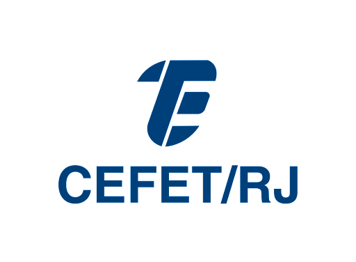

[![Contributors][contributors-shield]][contributors-url]
[![Forks][forks-shield]][forks-url]
[![Stargazers][stars-shield]][stars-url]
[![Issues][issues-shield]][issues-url]
[![MIT License][license-shield]][license-url]
[![LinkedIn][linkedin-shield]][linkedin-url]

<!-- PROJECT LOGO -->
 

  
  <h3 align="center">Flange Annotation Tool</h3>
  

    An annotation tool for subsea and surface flanges captures!
     
    <a href="https://github.com/nathnascimentto2/FlangeAnnotationTool"><strong>Explore the docs »</strong></a>
     
     
    <a href="https://github.com/nathnascimentto2/FlangeAnnotationTool">View Demo</a>
    ·
    <a href="https://github.com/nathnascimentto2/FlangeAnnotationTool/issues">Report Bug</a>
    ·
    <a href="https://github.com/nathnascimentto2/FlangeAnnotationTool/issues">Request Feature</a>
  

<!-- TABLE OF CONTENTS -->

  
Table of Contents

  <ol>
    <li>
      <a href="#about-the-project">About The Project</a>
      <ul>
        <li><a href="#built-with">Built With</a></li>
      </ul>
    </li>
    <li>
      <a href="#getting-started">Getting Started</a>
      <ul>
        <li><a href="#prerequisites">Prerequisites</a></li>
      </ul>
    </li>
    <li><a href="#usage">Usage</a></li>
    <li><a href="#roadmap">Roadmap</a></li>
    <li><a href="#contributing">Contributing</a></li>
    <li><a href="#license">License</a></li>
    <li><a href="#contact">Contact</a></li>
    <li><a href="#acknowledgments">Acknowledgments</a></li>
  </ol>

<!-- ABOUT THE PROJECT -->
## About The Project

This project worked as an undergraduate thesis for my degree in Control and Automation Engineering. 
It provides an useful computer vision tool to detect flanges in pipeline systems working offshore and onshore.  

Two approaches were considered on this development. Each uses a state-of-art model based on convolutional neural networks to integrate the detector module.
The algorithms selected were YOLOv4 and Faster R-CNN. Its results were checked in order to examine the most accurate one. Later studies showed that
YOLOv4 performed better than Faster R-CNN.

As part of the process, a database of flanges was established. It is available on this repository and was created with public data from Google Images and frames
from YouTube videos. 

A YouTube playlist named [Subsea and Surface Pipeline Systems](https://youtube.com/playlist?list=PLvofOEUnfw04W3652VkIUcnI6nQmN-eHq) was created by 
gathering several posts of offshore and onshore systems. Its videos were used to integrate the flange database.  

The source code was written and tested using the Google Colab platform. Check [Faster R-CNN Notebook](https://colab.research.google.com/drive/1c7it7KI6pfGZVyU_YjMEuu0yIg_L7TH7?usp=sharing) and [YOLOv4 Notebook](https://colab.research.google.com/drive/1pbTgUA7atxhPZpb3T8W_7Qp2ncpIAKqb?usp=sharing) for insights of the code.

### Built With

This section lists the major frameworks/libraries used on this project.  

* [Detectron2](https://github.com/facebookresearch/detectron2)
* [YOLOv4](https://github.com/AlexeyAB/darknet)
* [Voc2COCO](https://github.com/roboflow-ai/voc2coco)
* [YOLO_metric](https://github.com/whynotw/YOLO_metric)
* [README_template](https://github.com/othneildrew/Best-README-Template)

(<a href="#top">back to top</a>)

<!-- GETTING STARTED -->
## Getting Started

It is recommended to use Google Colab to test the scripts. It provides the necessary hardware to train and validade the models. 
Besides it allows the results to be saved directly on Google Drive.

Users can re-train and validate the models on the flange dataset. Otherwise, on can use my trained models available on 
my cloud folder [backup](https://drive.google.com/drive/folders/1dTAhuHgrRmxiJumfFThHo4h2s6LVdghS?usp=sharing). 
The file `yolov4-custom-flangedataset_best.weights` has the trained weights for YOLOv4. The Faster R-CNN model is in `outpus\model_final.pth`.

### Prerequisites

It is necessary to use GPUs to train and validade Faster R-CNN in all circunstances. 

YOLOv4 requires GPUs only on train stage. On validation, they are required on video predictions, otherwise users can run the Flange Annotation Tool 
on regular CPUs.

As mentioned, it is highly recommended to run the source scripts on Google Colab, as it may provide the necessary hardware. If using the free version, pay attention in the time limits of sessions with GPU. Always remember to switch the environment to a regular one (without hardware accelerator) once GPUs are no longer needed. 
Besides, avoid saving results locally as they will be deleted after once the session is over. Save results on cloud is usually the best, as it may also save memory resources 
and avoid session disconnection.

(<a href="#top">back to top</a>)

<!-- USAGE EXAMPLES -->
## Usage

(<a href="#top">back to top</a>)

<!-- ROADMAP -->
## Roadmap

- [x] Add Changelog
- [x] Add back to top links
- [] Add Additional Templates w/ Examples
- [] Add "components" document to easily copy & paste sections of the readme
- [] Multi-language Support
    - [] Chinese
    - [] Spanish

See the [open issues](https://github.com/nathnascimentto2/FlangeAnnotationTool/issues) for a full list of proposed features (and known issues).

(<a href="#top">back to top</a>)

<!-- CONTRIBUTING -->
## Contributing

Contributions are what make the open source community such an amazing place to learn, inspire, and create. Any contributions you make are **greatly appreciated**.

If you have a suggestion that would make this better, please fork the repo and create a pull request. You can also simply open an issue with the tag "enhancement".
Don't forget to give the project a star! Thanks again!

1. Fork the Project
2. Create your Feature Branch (`git checkout -b feature/AmazingFeature`)
3. Commit your Changes (`git commit -m 'Add some AmazingFeature'`)
4. Push to the Branch (`git push origin feature/AmazingFeature`)
5. Open a Pull Request

(<a href="#top">back to top</a>)

<!-- LICENSE -->
## License

Not available.

(<a href="#top">back to top</a>)

<!-- CONTACT -->
## Contact

Nathalia Nascimento - nathalia.nascimento@aluno.cefet-rj.com

Project Link: [https://github.com/nathnascimentto2/FlangeAnnotationTool](https://github.com/nathnascimentto2/FlangeAnnotationTool)

(<a href="#top">back to top</a>)

<!-- ACKNOWLEDGMENTS -->
## Acknowledgments

Use this space to list resources you find helpful and would like to give credit to.

* [Choose an Open Source License](https://choosealicense.com)
* [YOLOv4 Paper](https://arxiv.org/abs/2004.10934)
* [Faster R-CNN Paper](https://arxiv.org/abs/1506.01497)
* [Detectron2 Documentation](https://detectron2.readthedocs.io/en/latest/)
* [LabelImg Tool](https://github.com/tzutalin/labelImg)
* [YouYube Playlist](https://youtube.com/playlist?list=PLvofOEUnfw04W3652VkIUcnI6nQmN-eHq)
* [YOLOv4 Colab Notebook](https://colab.research.google.com/drive/1pbTgUA7atxhPZpb3T8W_7Qp2ncpIAKqb?usp=sharing)
* [Faster R-CNN Colab Notebook](https://colab.research.google.com/drive/1c7it7KI6pfGZVyU_YjMEuu0yIg_L7TH7?usp=sharing)

(<a href="#top">back to top</a>)

<!-- MARKDOWN LINKS & IMAGES -->
<!-- https://www.markdownguide.org/basic-syntax/#reference-style-links -->
[contributors-shield]: https://img.shields.io/github/contributors/nathnascimentto2/FlangeAnnotationTool.svg?style=for-the-badge
[contributors-url]: https://github.com/nathnascimentto2/FlangeAnnotationTool/graphs/contributors
[forks-shield]: https://img.shields.io/github/forks/nathnascimentto2/FlangeAnnotationTool.svg?style=for-the-badge
[forks-url]: https://github.com/nathnascimentto2/FlangeAnnotationTool/network/members
[stars-shield]: https://img.shields.io/github/stars/nathnascimentto2/FlangeAnnotationTool.svg?style=for-the-badge
[stars-url]: https://github.com/nathnascimentto2/FlangeAnnotationTool/stargazers
[issues-shield]: https://img.shields.io/github/issues/nathnascimentto2/FlangeAnnotationTool.svg?style=for-the-badge
[issues-url]: https://github.com/nathnascimentto2/FlangeAnnotationTool/issues
[license-shield]: https://img.shields.io/github/license/nathnascimentto2/FlangeAnnotationTool.svg?style=for-the-badge
[license-url]: https://github.com/nathnascimentto2/FlangeAnnotationTool/blob/master/LICENSE.txt
[linkedin-shield]: https://img.shields.io/badge/-LinkedIn-black.svg?style=for-the-badge&logo=linkedin&colorB=555
[linkedin-url]: https://www.linkedin.com/in/nathalia-nascimento-841b22108/
[product-screenshot]: images/screenshot.png
